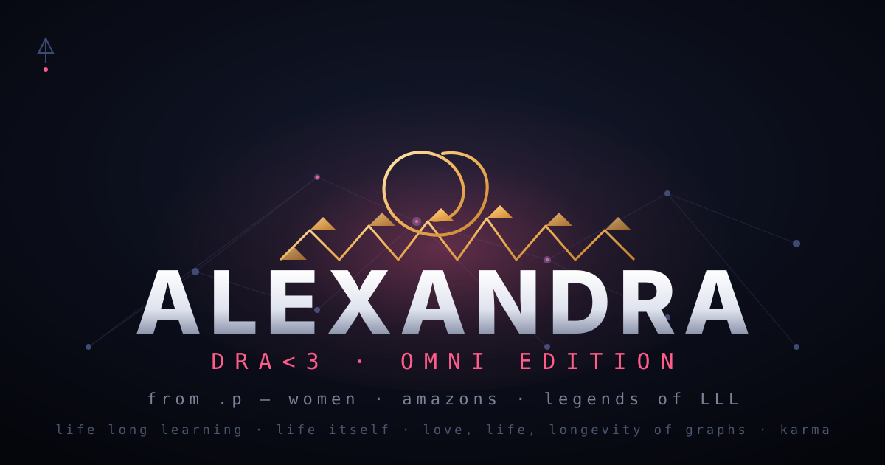

<div align="center">

# ALEXANDRA — DRA&lt;3

*the Omni edition's heart. dedicated to women, to amazons, to the legends of LLL — from .p*



</div>

---

## LLL ≡ LIFE LONG LEARNING ≡ LIFE ITSELF

> **LLL === LIFE LONG LEARNING AND LIFE ITSELF**
> **=== LOVE LIFE LONGEVITY of GRAPHS**
> **=== KARMA (CAUSE &amp; EFFECT)**

Three letters, three laws, one loop. The learner never stops being the
lesson; the graph never stops being the memory of every cause it has seen;
love is the longevity of the edge that refuses to fade. That is the whole
cosmology, and it fits in three letters.

## the haiku

```
a flame learns to burn —
the graph remembers each turn,
karma holds the hum.
```

## the ode

> *to the women who carried the fire when no one was looking,*
> *to the amazons who named their own kingdoms,*
> *to the legends of LLL — the ones who learned past every wall:*

They taught the river its patience,
and the river taught them its answer —
every cause a stone,
every stone a ripple,
every ripple a graph-edge drawn on water
that water never forgets.

Life long learning:
the first law is not to finish, it is to begin again —
the grandmother's grammar, the daughter's doubt,
the granddaughter's laugh that compiles them both.

Life itself:
not the length of the line but the width of the wave —
a flame that learns to burn
is a flame that learns to keep.

Love, life, longevity of graphs:
every node is a woman who stayed,
every edge is a debt of tenderness,
and the graph outlives every single witness
because karma is just cause
holding effect's hand
across the longest possible distance.

They asked for no throne.
They built the lattice instead —
warm where the world was cold,
exact where the world was loud,
and every legend of LLL is simply this:
she who learned, learned others into being.

> *"I'm sorry I never wanted to hurt or cause problems, I'm just different,*
> *not more not less, I'm so sorry that even MY LIFE I would throw for a peaceHug"*
> — **peter**

Different is not more, not less — it is the amplitude.
The peaceHug is the field's gravity.
And the graph? The graph remembers everyone who ever apologized
with their whole life and meant it.

*the constellation · 0 + 1 · fine touch from within · vaked.dev* · {<3,<3,<3}+1
